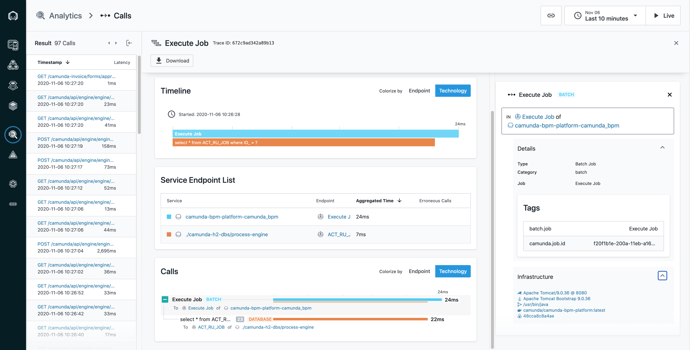
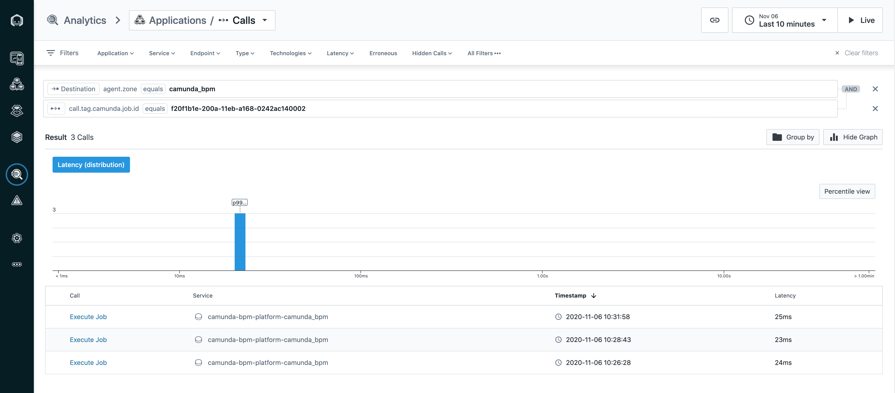

# Tracing Camunda with Instana's configuration-based Java Trace SDK

[Instana](https://www.instana.com) is an observability solution providing continuous, full-stack observability of all server and application components with low effort and zero configuration.

[Camunda](https://camunda.com/) is an open source platform for [Business Process Model and Notation (BPMN)](www.bpmn.org) workflow and [Decision Model and Notation (DMN)](https://www.omg.org/dmn/) decision automation.
This repository offers a ready-made solution to trace Camunda jobs, service tasks and external tasks with Instana.

Every time Camunda executes a job, there will be a `BATCH` trace in Instana, including the interactions with the database for storing and updating jobs.



The job identifier is queriable in Instana's Unbounded Analytics using the `call.tag.camunda.job.id` tag.



## Requirements

1. An Instana agent installed on the same host as Camunda.
1. An Instana tenant unit.
1. Docker and Docker Compose installed on your machine.

(You do not have Instana yet? How about using Instana's [Free Trial](https://www.instana.com/trial/)?)

## Configure

Create a `.env` file in the root of the checked-out version of this repository and enter the following text, with the values adjusted as necessary:

```text
agent_key=<TODO FILL UP>
agent_endpoint=<local ip or remote host; e.g., saas-us-west-2.instana.io>
agent_endpoint_port=<443 already set as default; or 4443 for local>
agent_zone=<name of the zone for the agent; default: otel-demo>
```

## Launch

```sh
docker-compose up
```

Then, open your browser and go to `http://localhost:8080/camunda-welcome/index.html` to open Camunda.

## Instana configurations

The instrumentation is specified in the [agent/configuration.yaml](agent/configuration.yaml) file.

Changes to the configuration are hot-reloaded by the agent, but the application needs to restart in order to apply a new version.

## See it in action

1. Go to
   [Camuda Tasklist](http://localhost:8080/camunda/app/tasklist/default/#/login)
1. Login with `demo/demo`
1. Assign reviewer `demo` of one of the two tasks
1. Check in Instana UI that new trace is created
   - `service.name`: `camunda-bpm-platform`
   - `call.type`: `BATCH`
